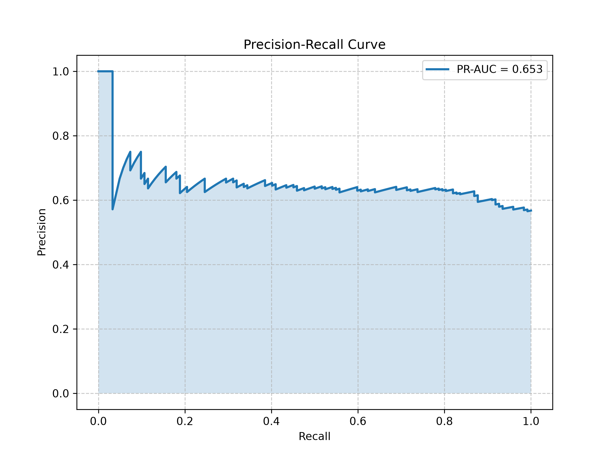
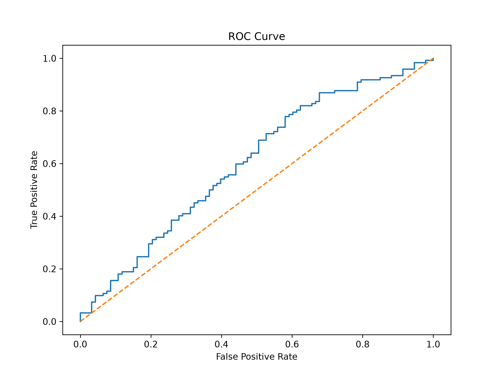

# Kepler-Net: Time-Series Exoplanet Detection Pipeline

An end-to-end MLOps and deep learning pipeline designed to classify Kepler target stars (Binary Eclipses vs. Planetary Transits) from raw flux data.

This repository serves as a research testbed for evaluating the physical limits of 1D Convolutional Neural Networks on highly imbalanced, micro-scale time-series datasets, establishing the baseline metrics for a future State Space Model (Mamba) implementation.

## The Core Problem
Planetary transits (U-shaped dips) and binary star eclipses (V-shaped dips) appear mathematically identical when viewed through a narrow temporal window in high-noise environments. The objective was to build an architecture capable of distinguishing these geometries across a limited dataset of 215 stars without falling into rote memorization.

## Architectural Evolution & Diagnostics

The pipeline underwent three distinct engineering phases to break through mathematical plateaus:

### 1. Stabilizing the Network (Fixing Mode Collapse)
Initial vanilla CNN architectures failed immediately. Negative parameter updates triggered "Dead ReLU" states, causing gradient evaporation. The model collapsed to a trivial solution, outputting a static ~0.50 probability for all inputs.
* **The Fix:** Implemented `BatchNorm1d` to enforce scaled variance across hidden layers and replaced standard activations with `LeakyReLU(0.2)` to ensure gradient survival.

### 2. Breaking the Memorization Bottleneck
Once stabilized, the model achieved a perfect `1.0000` Training PR-AUC, but Evaluation PR-AUC flatlined. The model was utilizing `AdaptiveAvgPool1d` to crush the sequence down to a single channel feature, effectively ironing out the transit shape and forcing the network to memorize high-resolution noise fingerprints for the 215 training stars.
* **The Fix:** Swapped to `AdaptiveMaxPool1d(4)` to enforce a severe structural bottleneck, and injected aggressive **Translation Augmentation** (`torch.roll`) to randomly phase-shift the time-series. This physically prevented the model from memorizing exact temporal indices.

### 3. Expanding the Receptive Field (The Final Architecture)
With memorization blocked, the model struggled with False Positives because a standard `kernel_size=5` sliding window lacks the temporal context to view the start, middle, and end of a transit simultaneously. 
* **The Fix:** Engineered a **Dilated Convolution** block. By scaling dilation exponentially across the global branch (`d=1, 2, 4`), the network's receptive field expanded to capture the macro-geometry of the entire transit dip without increasing the parameter count.

## Optimization & Results

Blindly optimizing for 95% Recall forced the model's decision boundary into the overlapping density curves of the two classes, resulting in severe False Positive inflation. 

The evaluation suite was rewritten to dynamically calculate the harmonic mean of Precision and Recall across all probabilities, pinning the decision boundary to the mathematically optimal **F1-Score Threshold**.

*(Note: Ensure your graphs are in the `/assets` folder for these to render)*

### 1. Prediction Confidence Distribution

*The final dilated architecture successfully pulled the Binary (Blue) and Planet (Orange) density distributions apart by mathematically expanding the receptive field to capture full transit geometries.*

### 2. Confusion Matrix (F1-Optimized)

*By discarding a hardcoded 95% Recall quota in favor of F1-Score optimization, the decision boundary shifted to maximize True Negatives (Binaries) while maintaining a balanced catch rate for true Planets.*

### 3. Precision-Recall Curve

*Demonstrates the model's performance on the highly imbalanced dataset (fewer planets than binaries). The jagged curve reflects the inherent volatility of a micro-dataset (215 samples) as the threshold adjusts.*

### 4. ROC Curve

*Validates that the model possesses genuine discriminative ability far exceeding a random guess (dashed line). It confirms the network learned underlying physical features rather than relying on class imbalances.*

## Conclusion & Next Steps

This project proved that while a 1D CNN can be forced to generalize on micro-datasets via heavy augmentation and dilated fields, it ultimately hits a hard physical ceiling due to its reliance on localized spatial windows. 

To achieve >0.90 AUC without requiring tens of thousands of target stars, the architecture must abandon spatial kernels in favor of continuous temporal memory. 

**Next Phase:** The Z-score normalized `.npz` tensors generated by this pipeline's `preprocess.py` engine are currently being ported into a custom, high-performance **Mamba State Space Model (SSM)** built in Rust to eliminate the sliding window bottleneck.